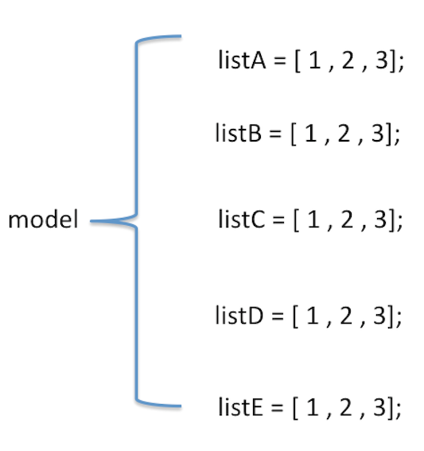

# SearchPageDemo

最近公司项目需要，写的一个搜索页面，这次写的时候感觉本搜索页面的三个部分可以封装起来，避免重复造轮子，因为我感觉已经造过很多次轮子了。所以就封装起来了，
目的是为了方便以后使用相同的东西。

## Preview


## 自定义的三个部分分别为
### 1.XYSearchBar : 封装了一个searchBar，由于g系统的searchBar修改样式不太好弄，以后此类的都可以直接调用实现
### 2.XYHotSearches ：封装了一个热门搜索小模块，分两部分：上面是title，下面是热门词。
### 3.XYSearchHistoryView ：封装了一个搜索历史记录小模块，分两部分：上面是title，下面是记录的历史和一个删除历史记录按钮（只在有记录的时候显示）。

## Usage
导入对应的```XYSearchBar.h```,```XYHotSearches.h```,```XYSearchHistoryView.h```，根据头文件参数配置即可。
### An Example

```Objective-C
  // 1.搜索条
    XYSearchBar *searchBar = [[XYSearchBar alloc] init];
    searchBar.frame = CGRectMake(40, 20, [UIScreen mainScreen].bounds.size.width - 80, 30);
    searchBar.placeholder = @"搜索";
    self.navigationItem.titleView = searchBar;
    [searchBar startEditing];
    // 开始搜索回调
    searchBar.startSearch = ^(NSString *keywords){
        DLog(@"keywords = %@",keywords);
        [self startSearchWithKeyWords:keywords];
    };
    //点击clearBtn取消搜索回调
    searchBar.cancelSearch = ^(){
        [self cancelSearchAndChangeUI];
    };
    
    
    // 2.热门词条 ---（热门词可以根据进入页面之后搜索值再来设置。）
    XYHotSearches *hot = [XYHotSearches sharedInstance];
    hot.title = @"热门搜索";
    hot.itemNames = @[@"项目管理",
                     @"活动管理",
                     @"志愿管理",
                     @"帮帮学院",
                     @"帮帮学院",
                     @"帮帮学院",
                     @"发起管理",
                     @"消息"];
    hot.frame = CGRectMake(0, 0, ScreenW, 193*heightRate);
    [scrollView addSubview:hot];
    // 点击某个热门词的回调
    hot.chooseItem = ^(NSInteger index,NSString *itemName){
    
        DLog(@"%ld--%@",index,itemName);
        [self startSearchWithKeyWords:itemName];
    };
    
    // 3. 历史记录
    XYSearchHistoryView *history = [[XYSearchHistoryView alloc]init];
    history.title = @"历史搜索";
    history.historyItems = self.searchHistoryArray;
    history.frame = CGRectMake(0, CGRectGetMaxY(hot.frame), ScreenW, history.totalHeight);
    [scrollView addSubview:history];
    
    // 点击历史记录中的项目的回调
    __weak typeof(XYSearchHistoryView *) weakHistory = history;
    history.itemClick = ^(NSString *title){
        
        DLog(@"用户选择了历史记录中的 - %@",title);
        [self startSearchWithKeyWords:title];
    };
    //删除历史记录的回调
    history.deleteBlock = ^(){
    
        // 用户选择清除历史记录，
        // 1.清除数据缓存
        [[XYSearchCache shareInstance] deleteAllData];
        // 2.移除历史记录板
        [weakHistory removeFromSuperview];
    };
```
# 搜索功能和逻辑处理分析
当以上的UI页面写完之后，就开始是搜索功能的实现了，但是当我做到这一步的时候发现，并不是我想象的那样简单。因为搜索结果是不确定的，从UI设计上来看，一共有5种类型的返回结果，而每个大类也是是否有搜索结果不确定，一共有几种返回结果不确定，每个组相应的返回个数为多少也不确定。由此而来的每一组可能情况的title位置也不确定。简而言之从搜索结果来看是一共有5！中排列结果的

### 搜索结果
model中共有5种子分类（即最多有5组数据），从排列组合上来讲一共有5！种排列结果。

### 如何排列
从刚才的分析中可以简单画图了解下排列的可能性

<!---->


Model:需要根据内部五个成员属性来相对应判空，最后返回正确的组数
List：需要根据具体的组，来判断对应组中有多少行，返回对应的行数

### 难点
我认为处理搜索结果的难点在于，搜索返回值Model的内容是不确定的，其具体类型也是不确定的，这直接导致了每组的类型不确定，每组的行数不确定，和每组对应的title也是不确定的。
简单说就是对复杂的返回值进行排列组合！

### 解决方案

